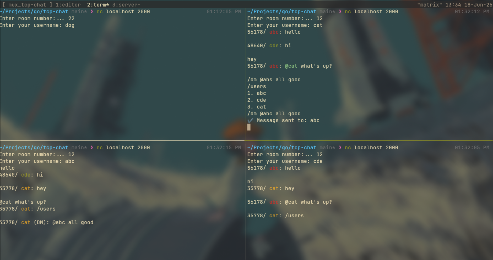

## Chat on CLI

- clone this project
- run go build -o chat_server
- ./chat_server

## Features

- `/room` to list active rooms.
- `/users` to list users in a room.
- Color coded name `red` `green` `yellow`.
- Tag users with username in a room `@<username>`.
- Message with tag `/dm` at the beginning and `@<username>` within to send direct message.
- Multiple mentions for multi DM.
- Key `secret` to enter a room.

